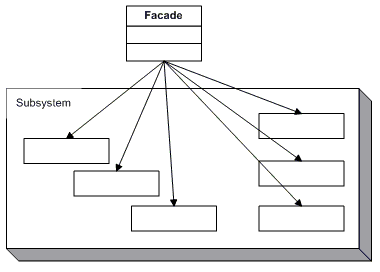

Facade Pattern
================================================================

</img>

퍼사드 패턴은(Facade Pattern)는 클래스 라이브러리 같은 어떤 소프트웨어의 다른 커다란 코드 부분에 대한 <strong>간략화된 인터페이스를 제공</strong>하는 객체이다.
- 소프트웨어 라이브러리를 쉽게 사용할 수 있게 해줌
- 라이브러리를 사용하는 코드들을 좀 더 읽기 쉽게 해줌
- 라이브러리 바깥쪽의 코드가 라이브러리의 안쪽 코드에 의존하는 일을 감소시켜 줌으로써 시스템을 개발하는데 있어 유연성 향상
- 좋게 작성되지 않은 API의 집합을 하나의 좋게 작성된 API로 감싸줌

### 의도
- 한 서브시스템 내의 인터페이스 집합에 대한 획일화된 하나의 인터페이스를 제공하는 패턴으로, 서브시스템을 사용하기 쉽도록 상위 수준의 인터페이스를 정의합니다.

### 활용성
다음 상황에서 퍼사드 패턴(Facade Pattern)을 사용 할 수 있다.
- <strong>복잡한 서브시스템에 대한 단순한 인터페이스 제공이 필요할 때.</strong> 시스템 범위가 확장되면, 또한 구체적으로 설계되면 서브시스템은 계속 복잡해집니다. 또한 패턴을 적용하면 확장성을 고려하여 설계하기 때문에, 작은 클래스가 만들어지게 됩니다.
  이런 과정은 서브시스템을 재사용 가능한 것으로 만들어 주고, 재정의할 수 있는 단위가 되도록 해 주기도 하지만, 실제 이런 상세한 재설계나 정제의 내용까지 파악할 필요가 없는 개발자들에게는 복잡해진 각각의 클래스들을 다 이해하면서
  서브시스템을 사용하기란 어려운 일입니다. 이럴 때 퍼사드 패턴은 서브시스템에 대한 단순하면서도 기본적인 인터페이스를 제공함으로써 대부분의 개발자들에게 적합한 클래스 형태를 제공

- <strong>추상 개념에 대한 구현 클래스와 사용자 사이에 너무 많은 종속성이 존재할 때.</strong> 퍼사드의 사용을 통해 사용자와 다른 서브시스템 간의 결합도를 줄일 수 있습니다. 즉, 서브시스템에 정의된 모든 인터페이스가 공개되면 빈번한 메서드 호출이 있을 수 있으나,
  이런 호출은 단순한 형태로 통합하여 제공하고 나머지 부분은 내부적으로 처리함으로써 사용자와 서브시스템 사이의 호출 횟수는 실질적으로 감소하게 되는 효과를 갖음

- <strong>서브시스템을 계층화 시킬 때.</strong> 퍼사드 패턴을 사용하여 각 서브시스템의 계층에 대한 접근점으로 제공합니다. 서브시스템이 다른 서브시스템에 종속적이라 하더라도, 각자가 제공하는 퍼사드를 통해서만 대화를 진행하게 함으로써 서브시스템 간의 종속성을 줄일
  수 있습니다. 이로써 서브시스템 내부 설계의 변경이 다른 서브시스템에 독립적으로 자유롭게 될 수 있는 것.

### 결과
1. <strong>서브시스템의 구성요소를 보호할 수 있습니다.</strong>  이로써 사용자가 다루어야 할 객체의 수가 줄어들며, 서브시스템을 쉽게 사용할 수 있습니다.

2. <strong>서브시스템과 사용자 코드 간의 결합도를 더욱 약하게 만듭니다.</strong> 서브시스템내 정의된 요소들은 강하게 결합될 수 있습니다. 서브시스템과 사용자 간의 결합이 약하면, 서브시스템 내의 요소를 다양화하는 작업을 원활하게 할 수 있습니다. 대규모 소프트웨어 시스템에서는 컴파일
   의존선을 줄이는 것도 매우 중요합니다. 서브시스템 클래스가 바뀔 때 재컴파일을 최소화함으로써 어떻게든 시간을 절약하고 싶을 것입니다. 퍼사드를 사용해서 컴파일 의존성을 최소화하면 주요 서브시스템에서 작은 변경으로 들어가는 재컴파일을 제한할 수 있씁니다. 퍼사드를 쓰면 다른
   플랫폼으로 이식도 단순해집니다. 하나의 서브시스템을 빌드하면서 다른 모든 서브시스템까지 끌고 들어갈 때가 적어지기 때문입니다. 

3. <strong>응용프로그램 쪽에서 서브시스템 클래스를 사용하는 것을 완전히 막지는 않습니다.</strong> 그러므로 Facade를 사용할지 서브시스템 클래스를 직접 사용할지 결정할 수 있습니다.

### 구현
1. <strong>사용자와 서브시스템 간의 결합도 줄이기.</strong> 
   - 사용자와 서브시스템 간의 의존성을 줄이는 방법은 Facade를 추상 클래스로 정의하고, 서브시스템을 나타내기 위해 이를 상속하는 구체 서브클래스를 정의하여 다른 구현을 정의
   - 서브클래싱을 하지 않으려면 다른 서브시스템 객체들을 조합하여 Facade를 구성
2. <strong>서브시스템 클래스 중 공개할 것과 감출 것.</strong>
   - 서브시스템의 인터페이스도 공개할지 말지를 생각해 봐야 함

### 시나리오
&nbsp;&nbsp;A 문서 솔루션회사의 제품을 B 회사에서 사용하고 있습니다. B 회사의 주임 이모씨는 문서 파일에 대한 읽기, 쓰기, 수정이 가능해야 한다고 사용자측의 요구사항을 받았습니다. A 회사로 부터 라이브러리 문서를 받아 참고하여 개발단계에 들어갔습니다. 라이브러리 문서 내용이
방대하여 개발하는데 라이브러리 문서를 보는시간에 대한 시간을 많이 할애 하였습니다.  
&nbsp;&nbsp;주임 이모씨가 작업 하던 모습을 옆에서 본 과장 김모씨는 이모씨에게 문서 오브젝트를 쓰기 쉽게 만들어 놓은 클래스가 있을거 라면서 찾아보라고 하였고 이모씨는 해당 클래스를 찾아 작업을 하여
쉽게 사용자가 요청한 내용에 대한 작업을 완료하였습니다. 주임 이모씨는 과장 김모씨에게 커피 한캔을 건내면서 감사하다고 하면서 과장님께서 가르쳐 주지 않았으면 몇일을 작업 했을거 같다고 말합니다. 과장 김모씨는 보통 라이브러리 형태로 모듈을 개발할 경우에는 모듈을 가져다 쓰기 쉽게 퍼사드 형태의
매니저 클래스를 제공한다고 말하였습니다.  
&nbsp;&nbsp;이모씨는 자리로 돌아와 기존에 작업하고 있던 테스트 코드들을 다 걷어내었습니다. 현재 시나리오에서 말하는 <strong>간략화된 인터페이스 제공</strong> 의 내용은 김과장이 말하는 퍼사드형태의 매니저 클래스가 되겠습니다. 이모씨는 다시한번 김과장님께 가서 
퍼사드형태의 매니저 클래스가 무엇인지 제차 여쭤보았고 김과장은 이모씨가 작업하던 코드를 보여주면서 이코드가 퍼사드형태의 매니저 클래스야라고 말하였고, 제차 너가 알게 모르게 짠 이 코드가 "디자인패턴 구조패턴에 속하는 퍼사드 패턴이야" 라고 말하였습니다.

</img>

간략화된 인터페이스를 제공(현재 문서에 대한 다양한 기능을 제공)  
<strong>Facade=</strong><strong style='color:green'>DocumentManager</strong> 
단순하고 일관된 통합 인터페이스를 제공하며, 서브시스템을 구성하는 어떤 클래스가 어떤 요청을 처리해야 하는지 알고 있으며, 사용자의 요청을 해당 서브시스템 객체에 전달합니다. 
 

현재 문서에 대한 페이지를 읽는 서브 시스템  
<strong>SubSystem1=</strong><strong style='color:green'>DocumentPageReader</strong> 
현재 문서를 대한 페이지를 쓰는 서브 시스템  
<strong>SubSystem2=</strong><strong style='color:green'>DocumentPageWriter</strong> 
서브시스템의 기능을 구현하고, Facade 객체로 할당된 작업을 실제로 처리하지만 Facade에 대한 아무런 정보가 없습니다. 즉, 이들에 대한 어떤 참조자도 가지고 있지 않습니다.

### 샘플 출력 결과
<pre><code>
Facade Pattern
==============================
타이틀 : 디자인 패턴
1. 페이지를 읽습니다.
서식의 헤더(머리말)를 읽습니다.
전략 패턴
서식의 본문을 읽습니다.
1. 페이지 내용입니다.
서식의 푸터(꼬리말)을 읽습니다.
Strategy DesignPattern
2. 페이지를 읽습니다.
서식의 헤더(머리말)를 읽습니다.
빌더 패턴
서식의 본문을 읽습니다.
2. 페이지 내용입니다.
서식의 푸터(꼬리말)을 읽습니다.
Builder DesignPattern
==============================
</code></pre>
#### [Wikipedia 링크]
#### https://ko.wikipedia.org/wiki/%ED%8D%BC%EC%82%AC%EB%93%9C_%ED%8C%A8%ED%84%B4

##### [구조 이미지]
<h5> <a href="https://mertarauh.com/tutorials/typescript-design-patterns/facade-pattern/">https://mertarauh.com/tutorials/typescript-design-patterns/facade-pattern/</a> </h5>
================================================================

[ 참고 ] 
- HeadFirst DesignPattern
- GoF의 디자인 패턴
- Java  언어로 배우는 디자인 패턴 입문