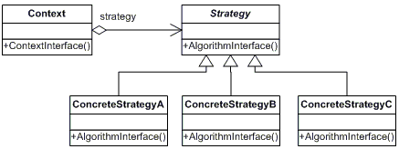

Strategy Pattern
================================================================

</img>

전략 패턴(Strategy Pattern) 또는 정책 패턴(Policy Pattern)은 실행 중에 <strong>알고리즘</strong>을 선택 할수 있게 하는 <strong>행위</strong> <strong>소프트웨어 디자인 패턴이다.</strong>
- 특정한 계열의 알고리즘들을 정의
- 각 알고리즘을 캡슐화
- 알고리즘들을 해당 계열 안에서 상호 교체가 가능하게 만듬

### 의도
- 동일 계열의 알고리즘군을 정의하고, 각 알고리즘을 캡슐화하며, 이들을 상호교환이 가능하도록 만듭니다. 알고리즘을 사용하는 클라이언트와 상관없이 독립적으로 알고리즘을 다양하게 변경할 수 있게 합니다.

### 활용성
다음 상황에서 전략 패턴(Strategy Pattern)을 사용 할 수 있다.
- <strong>행동들이 조금씩 다를 뿐 개념적으로 관련된 많은 클래스들이 존재할 때.</strong> 전략 패턴은 많은 행동 중 하나를 가진 클래스를 구성할 수 있는 방법을 제공
- <strong>사용자가 몰라야 하는 데이터를 사용하는 알고리즘이 있을 때.</strong> 노출하지 말아야 할 복잡한 자료 구조는 Strategy 클래스에만 두면 되므로 사용자는 몰라도 됨
- <strong>하나의 클래스가 많은 행동을 정의하고, 이런 행동들이 그 클래스의 연산안에서 복잡한 다중 조건문의 모습을 취할 때.</strong> 많은 조건문보다는 각각을 Strategy 클래스로 옮겨놓는것이 좋음

### 결과
1. <strong>동일 계열의 관련 알고리즘군이 생깁니다.</strong> Strategy 클래스 계층은 동일 계열의 알고리즘군 혹은 행동군을 정의하고 알고리즘 자체의 재사용도 가능하게 합니다. 즉 상속을 통해서 알고리즘 
   공통의 기능성들을 추출하고 이를 재사용 할 수 있습니다.

2. <strong>서브클래싱을 사용하지 않는 대안입니다.</strong> 상속은 다양한 알고리즘이나 행동을 지원하는 또 다른 방법입니다. 서로 다른 행동을 제공하기 위해 Context 클래스를 직접 상속받을 수도 있습니다. 
   그러나 이렇게 행동의 처리 방법을 Context에 직접 코딩하면 추후 수정이 어렵습니다. 즉, Context 자체의 행동과 알고리즘이 혼합되어 Context 클래스를 이해하거나 유지보수하기 어렵습니다. 
   그러므로 다양하게 알고리즘을 만들어 낼 수 없습니다. 단순히 알고리즘에서만 차이를 보이는 데도 여러 클래스들을 마구 만들어 내는 셈입니다. 알고리즘을 Strategy 클래스로 독립시키면 Context와
   무관하게 알고리즘을 변형시킬 수 있고, 알고리즘을 바꾸거나 이해하거나 확장하기도 쉽습니다.

3. <strong>조건문을 없앨 수 있습니다.</strong> 전략 패턴을 사용하면 원하는 행동들을 선택하는 조건문을 없앨 수 있습니다. 서로 다른 행동이 하나로 묶이면 조건문을 사용해서 정확한 행동을 선택할 수 밖에 없습니다. 그러나 서로 다른 Strategy 클래스의 행동을 캡슐화하면 이들 조건문을 없앨 수 있습니다. 전략 패턴을
   쓰지 않았다면 디렉토리 이름 생성하는 코드는 다음처럼 나올 것입니다.

    <pre><code>
    public enum DirectoryStrategyType {
        NowDate, Guid
    }

    switch (directoryStrategyType) {
        case NowDate:
            ....
            break;
        case Guid:
            ....
            break;
    }
    </code></pre>
    
    전략 패턴을 사용하면 다음과 같이 Switch Case 문을 없앨 수 있습니다.

    <pre><code>
    public void CreateDirectory() {
        string directoryName = DirectoryStrategy.MakeDirectoryName();
    }
    </pre></code>
    
    많은 조건문을 포함하는 코드는 전략 패턴의 필요성을 생각하게 됩니다.

4. <strong>구현의 선택이 가능합니다.</strong> 동일한 행동에 대해서 서로 다른 구현을 제공할 수 있습니다. 사용자는 서로 다른 시간과 공간이 필요한 여러 Strategy들 중 하나를 선택할 수 있게 됩니다.

5. <strong>사용자(프로그램)는 서로 다른 전략을 알아야 합니다. </strong> 사용자는 적당한 전략을 선택하기 전에 전략들이 어떻게 다른지 이해해야 합니다. 이를 위해 사용자는 각 구현 내용을 모두 알아야 합니다.
   그러므로 사용자가 이렇게 서로 다른 행동 각각의 특징을 이미 알고 있을 때 전략 패턴을 사용합니다. 

6. <strong>Strategy 객체와 Context 객체 사이에 의사소통 오버헤드가 있습니다. </strong> 서브클래스에서 구현할 알고리즘의 복잡함과는 상관없이 모든 ConcreateStrategy 클래스는 Strategy 인터페이스를 공유합니다.
   따라서 어떤 ConcreateStrategy 클래스는 이 인터페이스를 통해 들어온 모든 정보를 다 사용하지 않는데도 이 정보를 떠안아야 할 때가 생깁니다. 간단한 ConcreateStrategy는 하나도 사용하지 않을수도 있습니다.
   즉, 사용되지도 않을 매개변수를 Context 객체가 생성하고 초기화할 때도 있다는 말도 됩니다. 이러한 상황이라면, Strategy와 Context클래스 사이에 좀더 높은 결합도가 필요할지도 모릅니다.

7. <strong>객체 수가 증가합니다.</strong> 전략들로 응용프로그램 내의 객체 수가 증가합니다. 간혹, Context 객체들이 공유할 수 있는 상태 없는 객체로서 Strategy를 구현하여 이런 불필요한 오버헤드를 줄일 수도 있습니다. 이때, 
   처리에 필요한 상태 값을 Context 클래스가 관리합니다. 공유한 전략들은 호출 사이의 상태를 관리하지 말아야 합니다. 이 방법을 더욱 자세히 만든 것이 바로 플라이급 패턴입니다.

### 구현
1. <strong>Strategy 및 Context 인터페이스를 정의합니다.</strong> Strategy와 Context 인터페이스는 ConcreateStrategy가 Context에서 어떤 정보가 필요하다면 효율적으로 접근할 수 있고, 또 그 반대도 가능하도록 만들어져 있어야 함.
   - Context가 Strategy의 연산 쪽으로 데이터를 매개변수에 담아 보내는 방법.
     (데이터를 전략으로 보내는 것으로 인하여 Strategy 클래스와 Context 클래스 간의 결합도를 낮춤)
   - Context가 자기 자신을 Strategy 객체에 인자로 보내고 Strategy 객체는 Context 객체에서 데이터를 요청하는 방법
   - Strategy 클래스에 Context 클래스에 참조 정보 저장 이를 위해서는 Context는 데이터에 접근할 수 있는 더욱 정교한 인터페이스를 정의해야 함
     (두 클래스 사이의 결합도가 증가함)

2. <strong>전략을 제네릭 매개변수를 활용합니다.</strong>
3. <strong>Strategy 객체에 선택성을 부여합니다.</strong>Strategy 객체를 갖지 않는 편이 나을 때, Context 객체를 단순하게 만들 수도 있을 것입니다. Context는 Strategy 객체가 접근하기 전 자신에게 Stretegy 객체가 있는지 확인을 하고 있다면 그냥 그것을
   사용하고, 없으면 기본 행동을 수행합니다. (사용자가 기본 행동을 사용해도 무방하다고 느낀다면 객체를 사용하지 않아도 된다는 점)
### 시나리오
 사용자의 요구사항에 따라 특정 RootDirectory(현재 샘플은 실행파일 위치 Debug\Release)에 특정한 패턴의 디렉토리를 생성하고 싶다고 요청이 왔습니다. 요구사항의 일부분 내용에는 프로그램이 실행중에 특정한 디렉토리를 만드는 
방법도 변경이 되어야 한다고 명시되어 있습니다. 현재 시나리오에서의 알고리즘은 <strong>특정한 패턴의 디렉토리</strong>가 되겠습니다. 상황에 따라 프로그램의 동작중에 Guid 형태로 디렉토리를 생성하거나, 현재날짜로의 디렉토리 생성이
가능해야 합니다.

</img>

 
특정한 패턴의 디렉토리 이름을 만드는  
<strong>Strategy=</strong><strong style='color:green'>IDirectoryStrategy</strong> 
제공하는 모든 알고리즘에 대한 공통의 연산들을 인터페이스로 정의합니다. Context 클래스는 Concreate 클래스에 정의한 인터페이스를 통해서 실제 알고리즘을 사용합니다. 
 

Guid 형태의 디렉토리 이름을 생성하는  
<strong>ConcreateStrategy1=</strong><strong style='color:green'>GuidDirectoryStrategy</strong> 
현재 날짜(yyyy.MM.dd) 형태의 디렉토리 이름을 생성하는  
<strong>ConcreateStrategy2=</strong><strong style='color:green'>NowDateDirectoryStrategy</strong> 
Strategy 인터페이스를 실제 알고리즘으로 구현합니다.  

해당 Strategy를 사용하는  
<strong>Context=</strong><strong style='color:green'>TempDirectoryContext</strong> 
ConcreateStrategy 객체를 통해 구성됩니다. 즉, Strategy 객체에 대한 참조자를 관리하고, 실제로는 Strategy 서브 클래스의 인스턴스를 갖고 있음으로써 구체화합니다.
또한 Strategy 객체가 자료에 접근해가는 데 필요한 인터페이스를 정의합니다.
 

### 샘플 출력 결과
<pre><code>
DesignPattern Strategy Pattern
GuidDirectory MakeDirectory=43d83a19-70de-4964-94ff-27bfbe1340fc
NowDateDirectory MakeDirectory=2021.03.19

</code></pre>
#### [Wikipedia 링크]
#### https://ko.wikipedia.org/wiki/%EC%A0%84%EB%9E%B5_%ED%8C%A8%ED%84%B4
================================================================

[ 참고 ] 
- HeadFirst DesignPattern
- GoF의 디자인 패턴
- Java  언어로 배우는 디자인 패턴 입문
